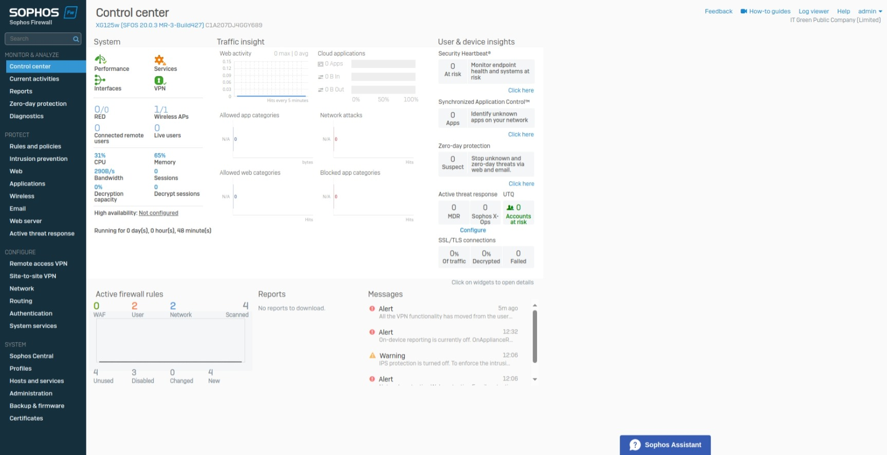

# Playing with Sophos

### Navigation
- [Installation](#installation)
- [Configuration](#configuration)
- [Web Interface](#web-interface)
- [Network Configuration](#network-configuration)
- [Firewall Configuration](#firewall-configuration)
- [NAT Configuration](#nat-configuration)

## Installation
- Turn on the Sophos device and wait for it to boot up.
- Connect to the device's web interface using a web browser.
  - Default lan interface is `eth0` or `Port 1` (depending on the model) with IP address `172.16.16.16/24`
  - Default wan interface is `eth1` or `Port 2` (depending on the model).

Welcome age

## Configuration
- Start the configuration process by accessing the web interface.

Basic configuration and setup admin password

Setup hostname and timezone

- Check basic setup

Check basic setup

- Check the configuration settings

Configuration summary

- Finish the configuration process by clicking the "Finish" button.

Finish configuration and wait for the device to reboot.

## Web Interface
- Access the web interface using a web browser.

Sophos web interface with login page

- Login to the web interface using the admin credentials.

Sophos control center

## Network configuration

Network interface configuration
  - Default interface Port 1 (LAN) with IP address `172.16.16.16/24`
  - Default interface Port 2 (WAN) with DHCP client enabled

Interface Port 1 configuration

## Firewall Configuration
- Firewall configuration

- Add firewall rules

Add firewall rule with test rule LAN to WAN (any)

## NAT Configuration
- NAT configuration

Default NAT configuration with Dynamic Source NAT
